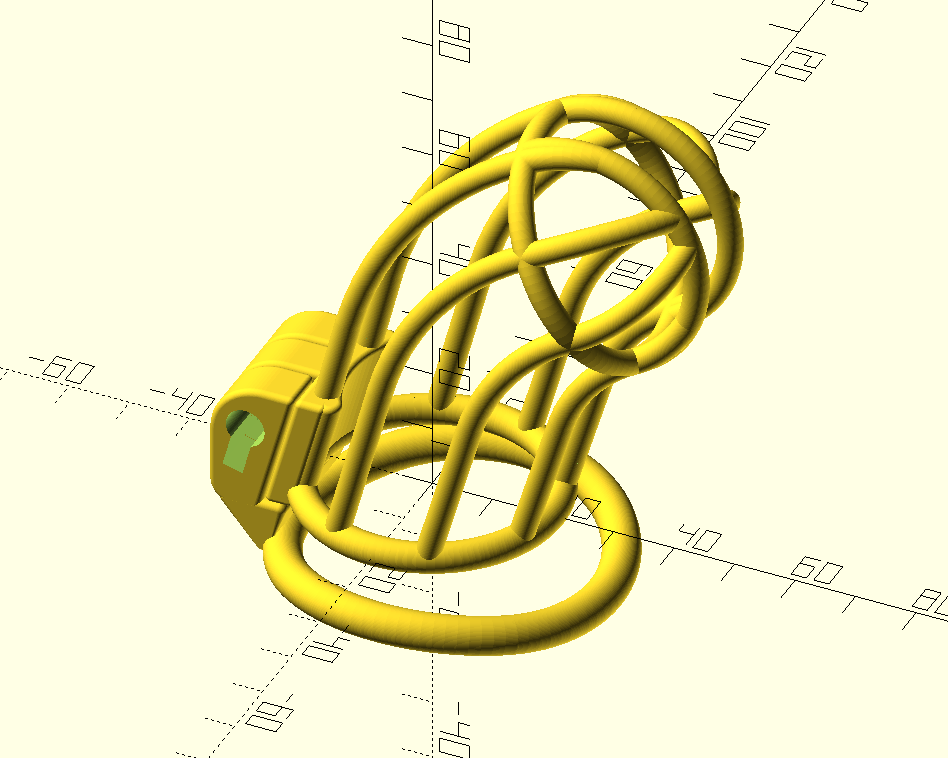

# (18+ NSFW) Parametric 3D-printable chastity cage in OpenSCAD
## Children, leave the room now!

 This work is licensed under a <a rel="license" href="http://creativecommons.org/licenses/by-sa/3.0/">Creative Commons Attribution-ShareAlike 3.0 Unported License</a>.

The only thing changed in this branch is the inclusion if a .stl file that has a pins that can be locked to the default sized 'key hole' on the chastity cage.
